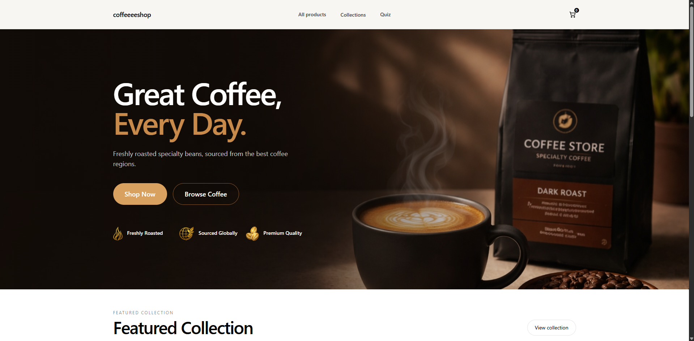
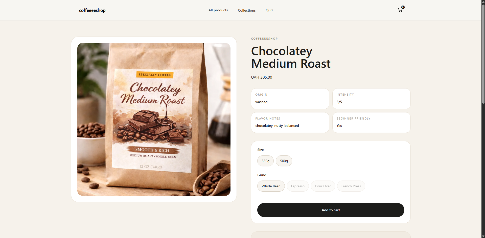
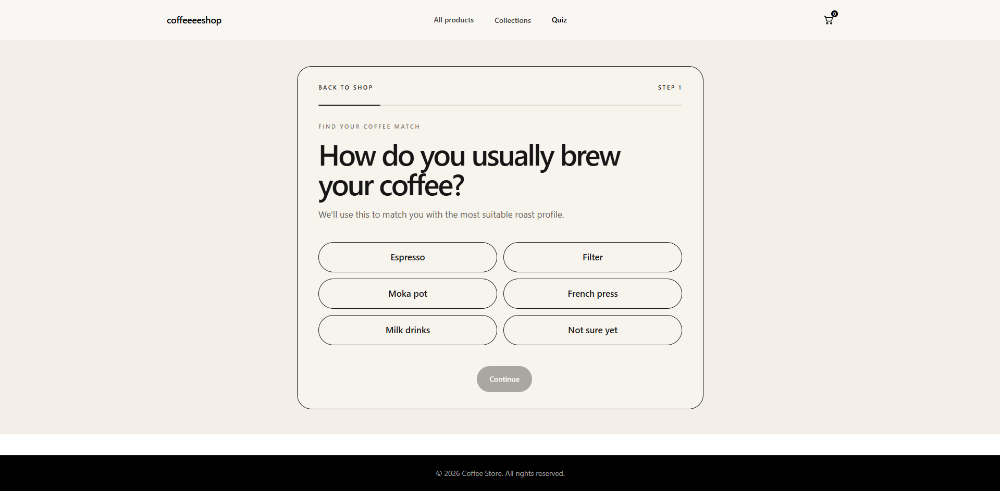

# Coffee Store — Headless Shopify (Hydrogen)

Modern headless Shopify storefront focused on performance, UX, and conversion.

This project demonstrates a custom eCommerce experience built with Hydrogen, including quiz-based product recommendations, optimized product pages, and clean UI architecture.

---

## Important

This project requires a connected Shopify store to run correctly.

To start the app locally, you need:

- a Shopify store
- Storefront API access token
- configured products and collections
- environment variables in `.env`

Without these credentials, the storefront cannot fetch data and will not work as expected.

## Local Preview

Project is intended to be run locally.

```
npm install
npm run dev
```

Open in browser:
http://localhost:3000

---

## Screenshots

### Homepage



### Product Page (PDP)



### Quiz Flow




## Features

* Custom Product Page (PDP)
* Quiz-based product recommendation flow
* Multi-step quiz UX
* Cart drawer with overlay
* Collection and product grid
* Responsive layout
* Shopify Storefront API integration
* Tailwind-based UI styling

---

## Key Focus

* Headless Shopify architecture
* UX and CRO improvements
* Scalable component structure
* Clean GraphQL data flow
* Frontend customization beyond standard Shopify themes

---

## Tech Stack

* Hydrogen
* Remix
* React
* Tailwind CSS
* Shopify Storefront API
* GraphQL
* Vite

---

## Project Structure

/app
/components
/routes
/lib
/styles
/public
/docs

---

## Setup

### 1. Install dependencies

```
npm install
```

### 2. Create `.env`

SHOPIFY_STORE_DOMAIN=your-store.myshopify.com
SHOPIFY_STOREFRONT_API_TOKEN=your_token

### 3. Run the project

```
npm run dev
```

---

## Demo Setup

To run the project locally:

1. Create Shopify store
2. Generate Storefront API token
3. Add products and collections
4. Paste credentials into `.env`
5. Run project

---

## What to Check

* Quiz → /app/routes/quiz
* Product page → /app/routes/products.$handle
* Cart drawer → /app/components/Aside
* GraphQL → /app/lib

---

## Future Improvements

* Subscriptions
* Advanced filtering
* Quiz personalization
* Performance optimizations

---

## License

MIT
